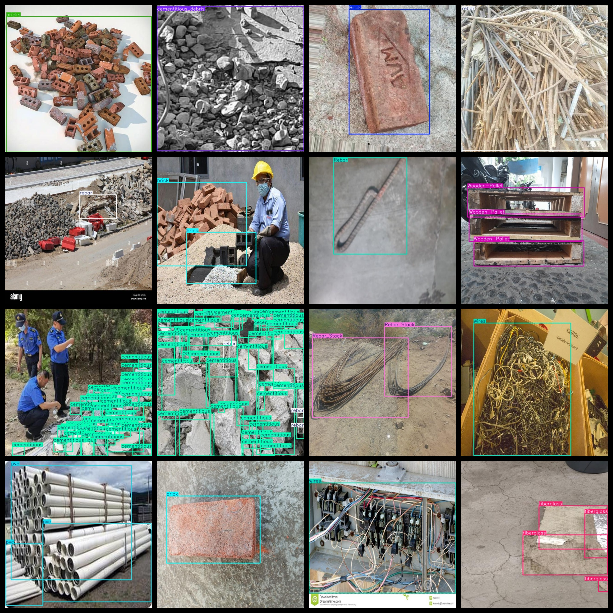
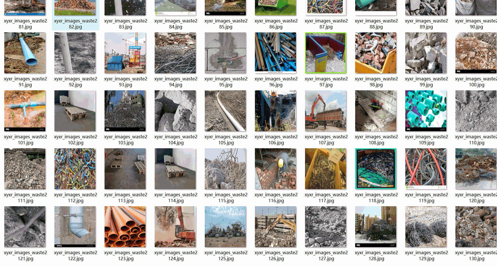

# Solid Waste Detection Dataset 6494 imagesVOC+YOLO format

Solid Waste Detection Dataset 6494 sheets VOC + YOLO format

Dataset format: Pascal VOC format + YOLO format (the txt file does not contain the split path, it only contains jpg images and corresponding VOC format xml files and yolo format txt files)

Number of images (number of jpg files): 6494

Number of xml files: 6494

Number of txt files: 6494

Category count: 25

The Github repository is: datasets_sl

["Brick", "Disposed Gravel", "Disposed Soil", "Rebar", "Rebar_Heap", "Rebar_Stack", "Roll-Off Dumpster", "Roll-off Dumpster", "Temporary Gravel", "Temporary Sand", "Temporary Soil", "Wooden-Pallet", "brick", "bricks", "cementitious", "cementitious_debris", "construction-waste", "fiberglass", "log", "metallic", "pallet", "pvc", "rebar", "wires", "wood"]

Tags: bricks, processed gravel, processed soil, rebar, rebar stack, rebar pile, tipped waste bin, tipped waste bin, temporary gravel, temporary sand, temporary soil, wooden pallet, bricks, bricks, adhesive material, adhesive material fragments, construction waste, fiberglass, raw wood, metal, tray, polyvinyl chloride, rebar, steel wire, wood

Number of boxes labeled in each category:

Brick Frames = 325

Disposed Gravel Frames = 1

Disposed Soil Frame Count = 31

Rebar frame count = 1526

Rebar_Heap frame count = 375

Rebar_Stack frame count = 674

Roll-Off Dumpster Frame Count = 16

Roll-off Dumpster Frame Count = 12

Number of Temporary Gravel Frames = 2

Temporary Sand Frames = 2

Temporary Soil Frames = 16

Wooden-Pallet frame count = 192

Brick Frames = 15432

【】『』「」【2985】

Cementitious Frame Count = 2590

Cementitious_debris frame number = 166

Construction-Waste Frame Count = 7

Fiberglass frame count = 831

The number of log boxes is 16253.

Metallic frame count = 469

pallet frame count = 1689

PVC frame count = 1261

rebar frame count = 2642

Wires frame count = 919

Wood frame count = 921

Total Frame Count: 49337

Number of images per category:

Brick occupies 153 pictures.

Disposed Gravel Ownership Image Count = 1

Disposed soil has 28 pictures.

Rebar has 609 pictures.

Rebar_Heap occupies a total of 270 images.

Rebar_Stack occupies 442 images.

Roll-off Dumpster occupancy count = 12

Roll-off Dumpster Occupancy Image Count = 12

Temporary Gravel occupies 2 pictures = 2

Temporary Sand Claims Image Count = 2

Temporary Soil occupies = 11

Wooden-Pallet occupies = 122

Bricks owning images count = 421

The number of bricks owned = 589

Cementitious occupies 878 images.

Cementitious_debris has 101 photos.

Construction waste occupancy image count = 1

Fiberglass occupies picture count = 311

Log of the number of images held = 182

Metallic possessions count = 15

The number of images owned by pallet = 959

PVC occupies the image count = 520

The number of rebar images is 735.

Wires owns 532 pictures.

Wood owns 344 pictures.

Image resolution: 640x640

Use the labeling tool: labelImg

Dataset Augmentation: Yes

Rules for annotation: Draw a rectangle around the category.

Important note: The dataset is not divided. The training verification test set needs to be divided by itself. The dataset images are mostly construction waste, construction site waste, and contain a small number of items under other scenarios.

Special Disclaimer: This dataset does not guarantee the accuracy of the trained models or weight files.

Annotation and image details are as follows:

## Images

---

Here is a pay link on Stripe (https://buy.stripe.com/3cs8yP7sY87d0vu9AB). Please contact me lonlonago@foxmail.com after funding $89, and I will send you a complete data files, thank you!

